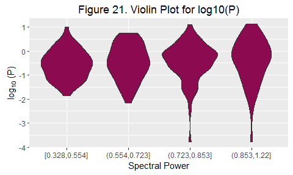
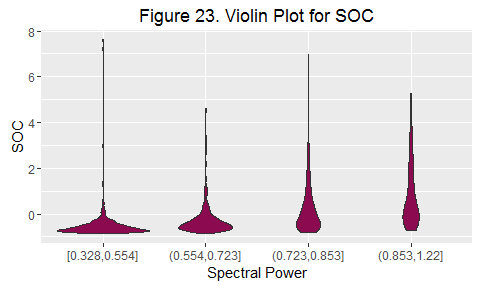

Introduction
------------

In my quest to build prediction models for the Kaggle Africa Soil
Property Prediction Challenge described in detail at
<https://www.kaggle.com/c/afsis-soil-properties>, I would like to
understand the data. I want to find and quantify relationships between
variables and also search for trends to support my expectation that the
provided data can be used to build a good prediction model. In the
following sections, I detail the steps i take to achieve my set goals.

Data Loading, Cleaning and Manipulation
---------------------------------------

### Data Loading

The data set is readily available at the Kaggle competition website
<https://www.kaggle.com/c/afsis-soil-properties/data>. This data set
comes in zipped csv format and is essentially clean. Column headers are
as follows:

-   **PIDN:** unique soil sample identifier
-   **SOC:** Soil organic carbon
-   **pH:** pH values
-   **Ca:** Mehlich-3 extractable Calcium
-   **P:** Mehlich-3 extractable Phosphorus
-   **Sand:** Sand content
-   **m7497.96 - m599.76:** 3578 mid-infrared absorbance measurements
-   **Depth:** Depth of the soil sample (2 categories:
    "Topsoil", "Subsoil")
-   BSA: average long-term Black Sky Albedo measurements from MODIS
    satellite images (**BSAN** = near-infrared, **BSAS** = shortwave,
    **BSAV** = visible)
-   **CTI:** compound topographic index calculated from Shuttle Radar
    Topography Mission elevation data
-   **ELEV:** Shuttle Radar Topography Mission elevation data
-   **EVI:** average long-term Enhanced Vegetation Index from MODIS
    satellite images.
-   LST: average long-term Land Surface Temperatures from MODIS
    satellite images (**LSTD** = day time temperature, **LSTN** = night
    time temperature)
-   REF: average long-term Reflectance measurements from MODIS satellite
    images (**REF1** = blue, **REF2** = red, **REF3** = near-infrared,
    **REF7** = mid-infrared)
-   **RELI:** topographic Relief calculated from Shuttle Radar
    Topography mission elevation data
-   **TMAP & TMFI:** average long-term Tropical Rainfall Monitoring
    Mission data (TMAP = mean annual precipitation, TMFI = modified
    Fournier index)

Columns SOC, pH, Ca, P, and Sand are the five (5) outcome variables to
be predicted by our final prediction model.

    data0 <- read.csv(unz("data_and_codes/train.zip","training.csv"), na.strings=c("NA",""))

The loaded data frame has 1157 rows or observations and 3600 columns or
variables; one (1) id variable, five (5) outcome variables, and 3594
predictor variables.

### Cleaning and Manipulation

There are a total of 3578 mid-infrared absorbance measurements. As per
the competition suggestion, we should "remove spectra CO2 bands which
are in the region m2379.76 to m2352.76". I extract the columns
corresponding to the spectral data into its own data.frame since we will
perform some pre-processing on them.

    a <- grep("m2379.76",names(data0))
    b <- grep("m2352.76",names(data0))

    data <- data0[,-seq(a,b)]

    ## Create spectra-only data subset
    infraredCols <- grep("^m[0-9].*?\\.[0-9].*",names(data))
    infraredData <- data.frame(data[,infraredCols])

    ## Create new data frame for plotting
    vec <- seq(1,nrow(infraredData))
    plotData <- data.frame(infraredData,Index=vec)

There are 15 CO**2 bands to be removed. This brings the
number of mid-infrared absorbance measurements variables to 3563.
Together with additional 16 predictor variables, we have a total of 3579
predictor variables.

Data Exploration
----------------

### 1. How do soil properties vary with depth?

This question can easily be answered by assessing the distributions of
each outcome variable by depth.

<table>
<thead>
<tr class="header">
<th align="left">Variable</th>
<th align="left">Mean.Topsoil</th>
<th align="left">Mean.Subsoil</th>
<th align="left">Sd.Topsoil</th>
<th align="left">Sd.Subsoil</th>
</tr>
</thead>
<tbody>
<tr class="odd">
<td align="left">Sand</td>
<td align="left">0.03</td>
<td align="left">-0.05</td>
<td align="left">0.97</td>
<td align="left">1.01</td>
</tr>
<tr class="even">
<td align="left">Ca</td>
<td align="left">0</td>
<td align="left">0.01</td>
<td align="left">1</td>
<td align="left">1.13</td>
</tr>
<tr class="odd">
<td align="left">P</td>
<td align="left">0.07</td>
<td align="left">-0.1</td>
<td align="left">0.93</td>
<td align="left">1.05</td>
</tr>
<tr class="even">
<td align="left">pH</td>
<td align="left">0</td>
<td align="left">-0.06</td>
<td align="left">0.86</td>
<td align="left">0.98</td>
</tr>
<tr class="odd">
<td align="left">SOC</td>
<td align="left">0.25</td>
<td align="left">-0.09</td>
<td align="left">1.21</td>
<td align="left">1.04</td>
</tr>
</tbody>
</table>

Table 1 shows that variations in distributions of outcome variables
Sand, Ca, P, SOC and pH, with depth exist, but are not alarmingly
different.

### 2. How do spectral signatures vary from site to site?

To answer this question, I select overlay plots of spectral signatures
at multiple sites to search for similarities and differences. This will
help in determining what kind of pre-processing we need to do to the
data prior to modeling.

    library(reshape2)

    ## compare spectral data from multiple sites
    pdata0 = data.frame(Spectral.Index=1:ncol(plotData),
                        Site1=as.vector(t(plotData[101,])),
                        Site2=as.vector(t(plotData[876,])),
                        Site3=as.vector(t(plotData[1074,])))
    pdata1 <- melt(pdata0,id.vars = "Spectral.Index")

<!-- -->

As Figure 6 shows, there is a clear pattern in the spectral signatures
as we go from one index to the next and this is consistent from site to
site. Also this plot supports the idea that we can treat each row of the
data frame as a signal (think time series signal) and apply relevant
data processing techniques to smooth, and compress our data without
losing relevant detail.

### 3. Can we smooth and compress our data without losing relevant detail?

As mentioned in the previous section, I decided to treat the rows of my
data frame as a signal and pre-process them accordingly. Here, I
decimate the number of signal samples (columns of each row in my data
frame containing only spectral data) by using the decimate function of
the signal package. This function applies a infinite impulse response,
or IIR filter (default), prior to decimation to avoid aliasing effects.
This anti-aliasing ability is what allows us to decimate the signals
while preserving the smallest detectable character in the signal at that
scale reliably. In the next plot, I show resulting decimation plots from
row 1 in my data frame.

    suppressWarnings(suppressMessages(library(signal)))

    siteNum <- 1
    newVec  <- newIndex <- newVecId <- vector()
    vec     <- as.vector(t(plotData[siteNum,]))

    for (fac in c(1,5,10,50)) {
        newVec   <- c(newVec,decimate(vec,fac))
        newIndex <- c(newIndex,seq(1,length(vec),by=fac))
        newVecId <- c(newVecId,rep(fac,length(seq(1,length(vec),by=fac))))
    }
    pdata2 <- data.frame(index=newIndex,value=newVec,Decimation=factor(newVecId))

<!-- -->

In Figure 7, decimation factors of 5 and 10 appear reasonable while
decimation factor of 50 clearly mismatches the original (decimation
factor of 1). We can even zoom tighter on the plot to show more detail.

<!-- -->

In Figure 8, we see that we lost significant detail with a decimation
factor of 50 and some detail with a decimation factor of 10. However,
not much is lost with a decimation factor of 5.

### 4. How much does spectral power change with prediction outcome variables? Can we detect dependencies?

In signal processing, we define the power of a signal as the sum of
absolute squares of each sample divided by the signal length or number
of samples. You can imagine power as a summary variable of the signal.
In this section, we show relationships between outcome variables and
color the plotted points by spectral power.This gives insight as to
whether the outcomes are detectable given spectral data. Note that the
spectral power used here were computed from the undecimated dataset.

The spectral powers calculated were divided into quartiles, and the
resulting plots are shown below. What we will see is that there are
relationships between the outcome variables and spectral measurements,
which supports the claim that we can use the spectral measurements as
good predictors of the outcome variables if sufficient training samples
are available.

    signalPower <- apply(infraredData^2,1,sum)/ncol(infraredData)
    signalPowerCut <- factor(cut(signalPower, quantile(signalPower, probs=0:4/4), include.lowest=TRUE))

    outcomeCols <- grep("Sand|Ca|ph|^P$|SOC",names(data),ignore.case = TRUE)
    pat <- "BSAN|BSAS|BSAV|CTI|ELEV|EVI|LSTD|LSTN|Ref1|Ref2|Ref3|Ref7|Reli|TMAP|TMFI|Depth"
    varCols <- grep(pat,names(data),ignore.case = TRUE)

    properties <- data.frame(data[,outcomeCols],data[,varCols],
                             Power=signalPower,Power.Quantile=signalPowerCut)

<!-- --><!-- --><!-- --><!-- --><!-- --><!-- --><!-- --><!-- --><!-- --><!-- -->

The next set of plots are violin plots showing the distributions of the
outcome variables grouped by spectral power quartiles. These plots also
support the claim that we can use the spectral measurements as good
predictors of the outcome variables if sufficient training samples are
available.

<!-- --><!-- --><!-- --><!-- --><!-- -->

### 4. Additional potentially useful data were provided. Are these truly useful? What is the relationship between the outcome variables and these potentially useful data?

Additional data were provided with the expectation that they may be
useful in building our prediction models. These are the data in the
columns named **BSAN**, **BSAS**, **BSAV**, **CTI**, **ELEV**, **EVI**,
**LSTD**, **LSTD**, **REF1**, **REF2**, **REF3**, **REF7**, **RELI**,
**TMAP**, and **TMFI**. I would like to look for trends that suggest
there are relationships between these predictor variables and the
outcome variables.

One quick way to examine this is the plot cross correlation values of
these variables and the outcome variables and look for values that
suggest moderate to strong relationships.

    outcomeCols <- grep("Sand|Ca|ph|^P$|SOC",names(data),ignore.case = TRUE)
    pat <- "BSAN|BSAS|BSAV|CTI|ELEV|EVI|LSTD|LSTN|Ref1|Ref2|Ref3|Ref7|Reli|TMAP|TMFI"
    varCols <- grep(pat,names(data),ignore.case = TRUE)

    n           <- length(outcomeCols)*length(varCols)
    outcomeName <- character(n)
    varName     <- character(n)
    corVal      <- numeric(n)

    k <- 1
    for (i in outcomeCols) {
        for (j in varCols) {
            outcomeName[k] <- names(data)[i]
            varName[k]     <- names(data)[j]
            corVal[k]      <- cor(data[,i],data[,j])
            k <- k + 1
        }
    }
    dmat <- cbind(outcomeName,varName,corVal)
    row.names(dmat) <- c(1:nrow(dmat))
    df <- data.frame(dmat)
    names(df) <- c("Outcome","Variable","Correlation")
    df$Correlation <- as.numeric(as.character(df$Correlation))

<!-- -->

In Figure 24, we see that there is an absence of strong correlation
between the outcome variables and the additional predictor variables.
There are however, a few moderately correlated variables. These are pH
and EVI, pH and TMAP, pH and LSTD, and pH and Ref7. While the outcome
variable pH is the most correlated with these additional predictor
variables, the outcome variable P is the least correlated.

Selected scatter plots for some of the points plotted in Figure 24 are
shown below.

<!-- --><!-- --><!-- --><!-- -->

Conclusions
-----------

Prior to building my prediction model for the Kaggle Africa Soil
Property Prediction Challenge, I explored data set to get a good
understanding of the relationship between outcome variables and
predictor variables with the hope of finding trends that suggest that
the prediction problem can be solved.

My exploratory data analysis shows discrimination of outcome variables
by infrared spectral values. I also found that additional potentially
useful datasets provided showed weak to no correlation with outcome
variables except the pH outcome variable where moderate correlation are
observed with EVI, TMAP, LSTD, and REF7.

The total number of predictor variables are 3579 and observations are
1157. I observed that the data set can be decimated without losing
relevant detail. If the number of predictor variables is not reduced and
a linear model is used for prediction, the resulting linear inverse
system will be underdetermined. Regularization parameters will be useful
in these cases.

There is a limit to how much the number of predictor variables can be
reduced. With a decimation factor of 50, significant detail is lost.
Also, a decimation factor of 10 loses some detail while a decimation
factor of 5 loses minimal detail. For our prediction model, I suspect
data sets compressed with a decimation factor of 5 or 10 will be
adequate. We will have to run some tests to confirm this.
